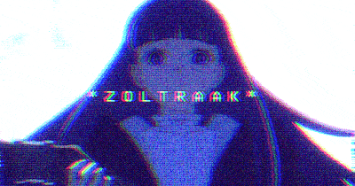

	

<i>
« I'm being overwhelmed by the sheer number of attacks, pure and simple... Damn you, Frieren. How did you train this girl? »
</i>

Heeeey, I'm Jasiel and I love the music from [King Gizzard and the Lizard Wizard](https://www.youtube.com/watch?v=IpUKO-WKaqo), I also create [shaders](https://www.shadertoy.com/user/Darkensses) for fun which led me to get into computer graphics with [ThreeJS](https://x.com/Darkensses/status/1887982603866698227). I train and play flag football 🚩🏈

### 💼 Current role
QA Automation Specialist at [Softtek](https://www.softtek.com).

### 😎 Ask me about
- How to automate tests using `playwright`, `selenium` or using the bare protocols such as `webdriver` and `CDP`.
- Basic/Intermediate concepts about graphics, `GLSL` and shaders.
- How to patch a PSX game using a hex editor and `javascript`.
- Why I hate `java` so much that I work on it most of the time lol.
- Musical micro-generes and underground (or at least not so well known) artists to discover new music.

### 🔊 Earworm
[mischluft | Boiler Room: Ghent](https://www.youtube.com/watch?v=_xR-kppeKY8)
